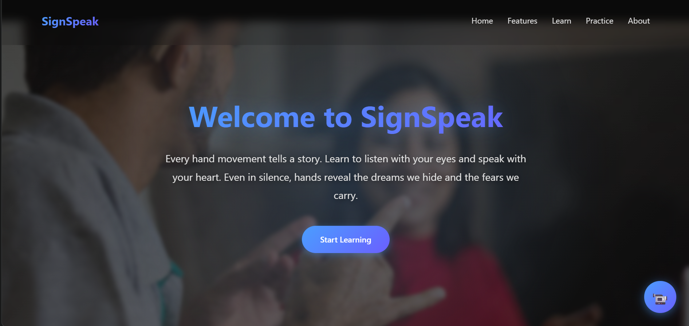
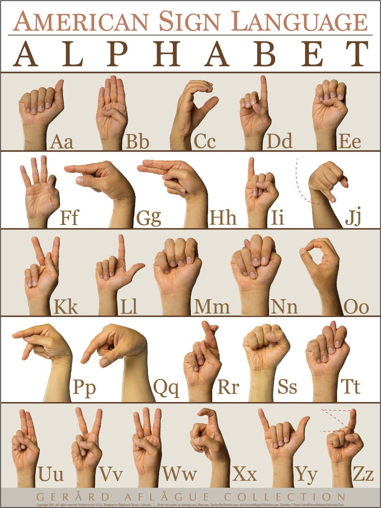
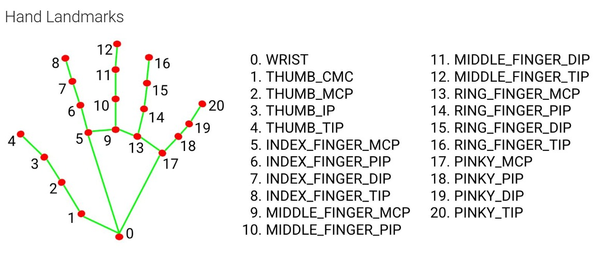
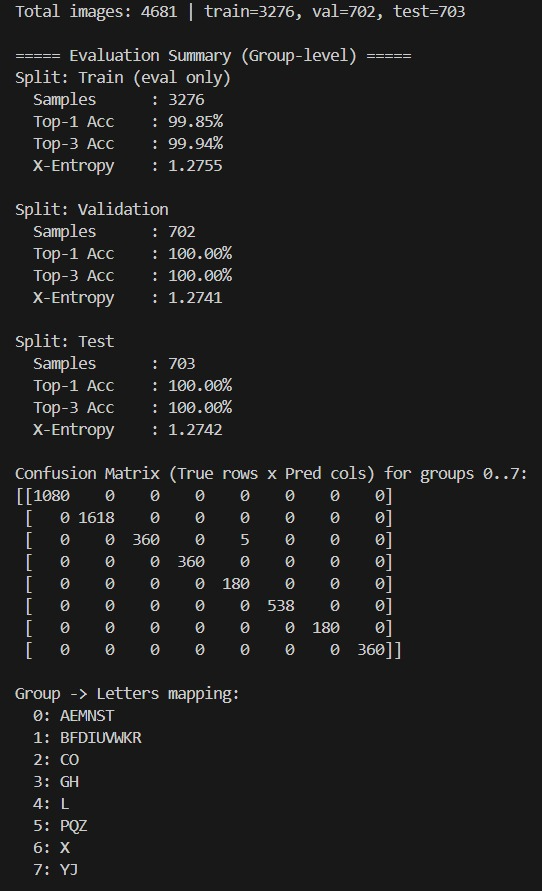

# ✋ ASL Sign Language to Text and Speech Conversion

This project performs **real-time American Sign Language (ASL) alphabet recognition** (A–Z) and converts hand signs into **text** and optionally **speech**.


It uses:
- **Mediapipe** (via CVZone) to track the user’s hand in real-time.
- **A CNN Model** (`cnn8grps_rad1_model.h5`) trained to predict one of **8 gesture groups**.
- **Rule-based logic** to refine group predictions into **26 ASL letters**.
- **Spell checking** + **Text-to-Speech** for enhanced communication.

📌 The model is trained on the **ASL Mediapipe Landmarked Dataset (A–Z)** available on Kaggle:

> https://www.kaggle.com/datasets/granthgaurav/asl-mediapipe-converted-dataset

In this project, the CNN model (`cnn8grps_rad1_model.h5`) was trained using this dataset and the
trained weights are saved in the repository so you can run real‑time inference without re‑training.

---

## 🔤 ASL Alphabet Reference

(

---

## ❓Why Alphabet-Level Recognition Instead of Whole Words

This project focuses on recognizing individual ASL alphabet letters (A–Z) rather than full ASL words. The main reasons are:
| Benefit | Description |
|--------|-------------|
| Beginner-friendly | You only need to learn 26 hand signs |
| More universal | Fingerspelling is widely used in ASL |
| Any word can be formed | Even unseen/new vocabulary |
| Less data required | Full-word ASL recognition requires huge datasets |


While alphabet-based communication is slower than using full ASL vocabulary, it is the most accessible, universal, and scalable entry point for real-time sign-language interpretation.

---

## 🚀 Features

✔ Real-time ASL alphabet recognition  
✔ 21-point hand landmark tracking  
✔ Skeleton rendering input to CNN  
✔ CNN predicts gesture groups (0–7)  
✔ Rule-based refinement to A-Z  
✔ Sentence construction using gestures  
✔ Spell suggestions using `pyenchant`  
✔ Text-to-speech output using `pyttsx3`  
✔ Simple and user-friendly Tkinter GUI  

---

## 1. 📚 Dataset

- **Name**: ASL Mediapipe Landmarked Dataset (A–Z)
- **Source**: Kaggle – `granthgaurav/asl-mediapipe-converted-dataset`
- **Classes**: 26 letters (A–Z) of American Sign Language fingerspelling.
- **Samples per class**: 180 images per letter.
- **Total images**: 4,680+ images (4681 in my split: 3,276 train, 702 validation, 703 test).
- **Data format**:
  - Images where the hands have already been processed with **Mediapipe**.
  - Each image encodes the **hand landmarks** (finger joint locations and orientation) as a rendered skeleton.
  - Mediapipe provides **x, y, z** coordinates for each joint → converted into clean **white-background skeleton images** used for training.

### 🎯Why We Used Skeleton Dataset Instead of Bare Hand Images

We used a Mediapipe-landmark skeleton dataset instead of raw hand camera images because:

- **Background Independent**  
  Only the hand pose is captured — no background, clothing, or lighting distractions.

- **Skin Tone Independent**  
  Since only joints and structure are used, performance does not depend on skin color.

- **Higher Accuracy with Less Data**  
  Skeleton-based learning focuses purely on geometry, so **~4680 images** are enough.  
  Raw images would require **50,000+ training samples** to achieve similar results.

- **Robust in Real-Time**  
  The model works smoothly across different environments and camera quality.

- **Geometric Rule Integration**  
  Exact joint locations allow **rule-based refinement** of look-alike letters  
  (e.g., M/N/S/T, U/V/W, G/H, P/Q/Z), which is not possible with raw images alone.

- **Fast Training & Inference**  
  Smaller, meaningful input → quicker prediction → real-time performance.

> Skeleton dataset provides only the essential hand structure,
> making the model more **accurate, efficient, and environment-independent** 
> than training with bare hand images.


### ✋Mediapipe Hand Landmarks



The Mediapipe framework detects and tracks **21 hand landmarks** on each hand. These landmarks represent key anatomical points:

- **Landmark 0**: Wrist (base of hand)
- **Landmarks 1–4**: Thumb (CMC, MCP, IP, Tip)
- **Landmarks 5–8**: Index finger (MCP, PIP, DIP, Tip)
- **Landmarks 9–12**: Middle finger (MCP, PIP, DIP, Tip)
- **Landmarks 13–16**: Ring finger (MCP, PIP, DIP, Tip)
- **Landmarks 17–20**: Pinky finger (MCP, PIP, DIP, Tip)

Each landmark is represented by normalized `(x, y, z)` coordinates, where:
- **x, y**: 2D position in the image (0–1 range, relative to frame dimensions)
- **z**: Depth information (approximate distance from camera)

These 21 landmarks are used to:
1. **Render the skeleton image** (green lines connecting joints, red circles at landmarks)
2. **Extract geometric features** for rule-based refinement (distances, angles, relative positions)
3. **Make the system robust** to background, lighting, and camera variations

---

## 2. 🧠 Model Training

The system is split into two main parts:

1. **Offline training** (on the Kaggle dataset)
2. **Online inference application** (`prediction.py`) that runs on a webcam stream


### 🔹 Dataset
- Used ASL Mediapipe Skeleton Dataset from Kaggle
- Each sample already contains **21 hand landmarks** converted into a **skeleton image**
- Letters grouped into **8 similar-gesture categories** for better accuracy

### 🔹 Pre-processing
- All images resized to **400 × 400 × 3**
- Pixel values normalized to **0–1**
- Data split into:
  - 80% → Training Set
  - 20% → Validation Set

### 🔹 Model Architecture
- Convolutional Neural Network (CNN) built using **TensorFlow + Keras**
- Main layers include:
  - Convolution Layers (feature extraction)
  - Max-Pooling Layers (down-sampling)
  - Dense Layers (classification)
- Final layer uses **Softmax** activation  
  → Predicts **8 gesture groups**

### 🔹 Output
- Trained model saved as:  
  **`cnn8grps_rad1_model.h5`**
- This model is later used during real-time prediction to classify gesture groups

---

## 3. 🧩 Why this Method

### 3.1. Why Mediapipe Landmarks + Skeleton Images

- **Robustness to background**: By working on landmark skeletons instead of raw images, the model ignores
  background clutter, clothing, and lighting variations.
- **Geometric interpretability**: Landmark coordinates correspond to real anatomical points (finger joints). That
  allows building meaningful **rule‑based constraints** on top of the CNN.
- **Data efficiency**: Landmarks compress the visual information into a low‑dimensional pose; this typically
  requires fewer images to generalize well.

### 3.2. Why an 8‑Group CNN instead of 26 Direct Classes

Certain ASL letters have very similar hand shapes.  
Example letter look-alike groups:

- **A / E / M / N / S / T**
- **U / V / W**
- **G / H**
- **P / Q / Z**
- **I / J**
- **B / D / F / R / K**
- **C / O**

If we train the model to directly classify **26 letters**, the CNN easily gets confused within these similar shapes.

So instead, we convert the 26 letters into **8 larger gesture groups**:
| Group | Letters in Group |
|-------|-----------------|
| 0 | A, E, M, N, S, T |
| 1 | B, D, F, I, U, V, W, K, R |
| 2 | C, O |
| 3 | G, H |
| 4 | L |
| 5 | P, Q, Z |
| 6 | X |
| 7 | Y, J |

This gives multiple benefits:

#### ✔ Higher Accuracy
Model only needs to separate **8 groups** → easier learning → better performance.

#### ✔ Less Training Data Required
26-class training needs **much larger dataset**.  
Grouping allows strong results with smaller dataset (~4680 images).

#### ✔ Reduces Misclassification of Look-alike Letters
Fine separation is done later using **geometric rules** on Mediapipe landmarks.

#### ✔ Faster & More Stable Training
Less output complexity → faster training & real-time prediction stability.

👉 Final Refinement:
Once the model predicts the correct **group**,  
rule-based logic uses distance/angle checks to determine the **exact letter**.

> Combining CNN (for general shape) + Rules (for fine differences)  
> gives the best performance with limited data and maximum accuracy.


This hybrid approach takes advantage of both deep learning and classical rule‑based logic.

### 3.3. Why CNN for Training

- CNNs are the **standard choice for image‑based classification** and work very well on structured inputs like the
  400×400 skeleton images.
- Convolutions capture local patterns such as fingertip arrangements and palm orientation.
- The preprocessed images are small enough that a moderate‑sized CNN can be trained efficiently even on
  mid‑range GPUs or CPUs.

---

## 4. ⚙️Training Setup 


- **Input**: 400×400×3 images of Mediapipe‑rendered hand skeletons.
- **Target**: One of 8 group labels (0–7) as described above.
- **Model type**: Keras CNN with a softmax output layer over 8 classes.
- **Loss**: Cross‑entropy classification loss.
- **Metrics**: Top‑1 accuracy, Top‑3 accuracy, and cross‑entropy.
- **Data split** (group‑level):
  - Train: 3,276 images
  - Validation: 702 images
  - Test: 703 images

### 4.1. Evaluation Results (Group‑Level)



---

## 5. 🗂️ Project Structure


- `prediction.py` – Main application  
- `cnn8grps_rad1_model.h5` – Trained CNN model  
- `dataset/` – Training dataset  
- `requirements.txt` – Dependencies  

---

## 6. 🏃 How to Run the Application

### 6.1. Prerequisites

- **Python**: 3.x
- **Operating System**: Tested on Windows (other OSes may also work with the right dependencies).
- A working **webcam**.

### 6.2. Install Dependencies

From the project root directory:

```bash
pip install -r requirements.txt
```

Make sure you have the following key packages (they are listed in `requirements.txt`):

- `opencv-python`
- `cvzone`
- `mediapipe` (used internally by cvzone)
- `tensorflow` / `tensorflow-gpu` (for loading and running the CNN)
- `pyttsx3` (text‑to‑speech)
- `pyenchant` (spelling suggestions)
- `Pillow` (image handling for Tkinter)

### 6.3. Run

From the project root:

```bash
python prediction.py
```

This will:

- Open a GUI window.
- Start the webcam feed on the left side.
- Continuously detect your hand and display the recognized character and sentence on the right.
- Offer spelling suggestions below the camera view.
- Allow you to **Clear** the sentence or **Speak** it via text‑to‑speech.


### 6.4. Notes on Gestures and Special Controls

- Certain poses are mapped to control tokens:
  - **`next`** gesture: Confirms the current character and appends it to the sentence.
  - **`Backspace`** gesture: Deletes the last character.
  - **`Double spaces or pause gestures`** insert space characters between words.
- A temporal buffer of the last 10 predictions is used to avoid accidental triggers from noisy frames.

These rules are implemented in the `predict` method in `prediction.py`.

---

## 🧑‍💻 User Flow – How the System Works

1️⃣ **User shows a hand gesture** in front of the webcam.  
The camera captures the live hand image.

2️⃣ **Mediapipe Hand Tracking** detects the hand and extracts  
21 key-points (x,y,z coordinates) of the hand skeleton.

3️⃣ **CVZone Visualization** draws the skeleton on a clean  
white background for better feature clarity.

4️⃣ The 21 landmark points are sent to the **trained CNN model**  
(TensorFlow) which predicts the correct **gesture group (0–7)**.

5️⃣ **Rule-Based Decision Logic** checks specific finger angles and distances  
to identify the **exact letter (A–Z)** within that group.

6️⃣ The **predicted letter** is shown on the screen in real-time.

7️⃣ **Auto-Suggestions Feature**  
The last typed word is checked using a dictionary  
and **word suggestions** are displayed for correction.

8️⃣ **Clear Button**  
User can clear the entire text with one click.

9️⃣ **Speak Button**  
pyttsx3 converts the written sentence to speech  
allowing the system to **speak the predicted text** out loud.

📌 Summary:  
Camera → Mediapipe (features) → CNN Model (Group) → Rules (Final Letter)

---

## 7. 🌟 Possible Extensions

- **Re‑training or fine‑tuning** on:
  - More users and lighting conditions.
  - Dynamic signs (short sequences) instead of single letters.
- **Direct landmark model**:
  - Train a network directly on 3D/2D landmark coordinates instead of their rendered images.
- **Export to mobile / web** using TensorFlow Lite or WebAssembly.
- **Multi-language support**: Add support for other sign language systems such as ISL, BSL, etc.
---

## 8. 🙌 Acknowledgements

- **Dataset**: [ASL Mediapipe Landmarked Dataset (A–Z)](https://www.kaggle.com/datasets/granthgaurav/asl-mediapipe-converted-dataset)
  by Granth Gaurav.
- **Hand tracking and Landmark Detection**: Mediapipe and cvzone.
- **Deep learning framework**: TensorFlow with Keras.
- **Text‑to‑speech**: pyttsx3.
- **Spell checking**: pyenchant.

- **Computer Vision Processing**: OpenCV (for image capture, processing, and display)


