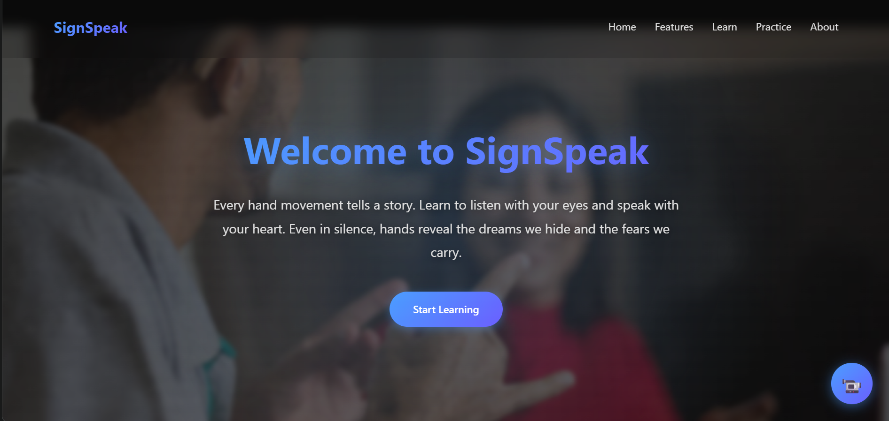
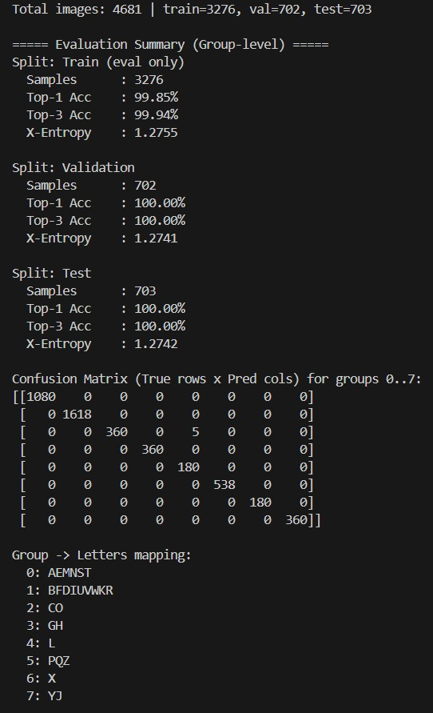
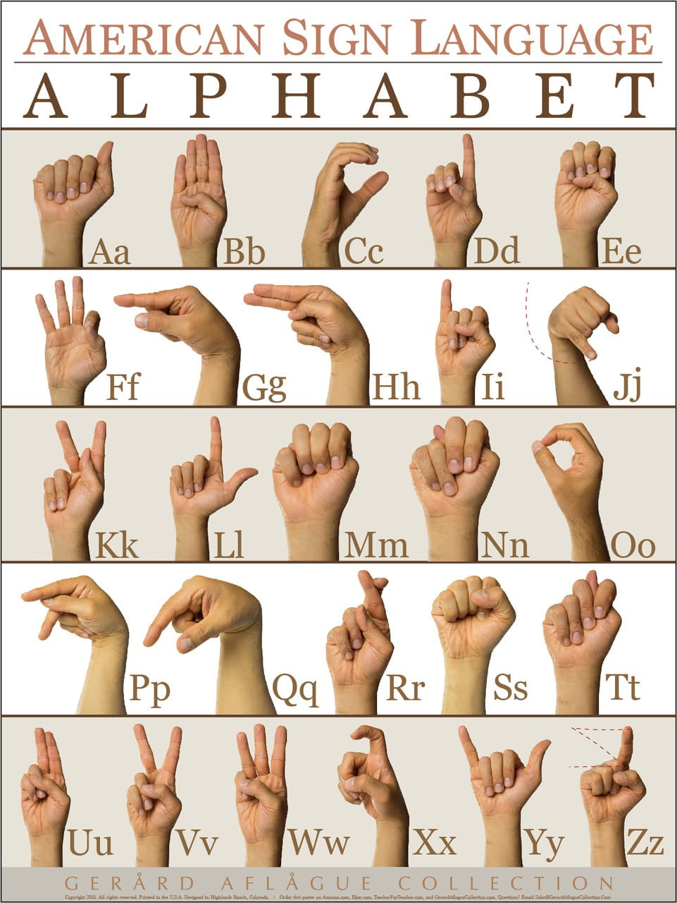
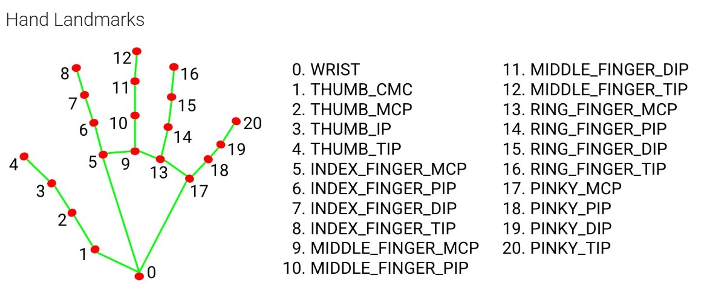

<a id="signspeak"></a>

<p align="center">
  
</p>

<h1 align="center">SignSpeak ✋</h1>
<p align="center">
  A Real-Time ASL Sign Language to Text and Speech Conversion Platform
</p>

<p align="center">
  
  
  
  
  
  
  
</p>

**SignSpeak** is a full-stack sign language learning and recognition platform designed to make American Sign Language (ASL) accessible to everyone — combining an interactive web interface for learning and practice with a real-time desktop recognition engine powered by computer vision, deep learning, and rule-based logic.

Built with Flask, TensorFlow, MediaPipe, and OpenCV, it provides alphabet learning (A–Z), practice quizzes, live webcam-based sign recognition, spell suggestions, and text-to-speech output — all from a single, user-friendly platform.

**Local App** 👉 [http://localhost:5000](http://localhost:5000) *(after running `python app.py`)*

## Table of Contents
- [💡 About the Project](#about-the-project)
- [⚡ Quick Start](#quick-start)
- [✨ Features](#features)
- [🗂️ Project Structure](#project-structure)
- [🖥️ Tech Stack](#tech-stack)
- [📄 Pages & Sections](#pages--sections)
- [🔌 API Routes](#api-routes)
- [🚀 Getting Started](#getting-started)
- [🧠 Model & Dataset](#model--dataset)
- [🎮 Gesture Controls](#gesture-controls)
- [🔧 Troubleshooting](#troubleshooting)
- [🚀 Future Enhancements](#future-enhancements)
- [🤝 Contributing](#contributing)
- [🙏 Acknowledgements](#acknowledgements)
- [📜 License](#license)

---

## 💡 About the Project

**SignSpeak** is an end-to-end ASL fingerspelling platform. It allows:

- **Learners** to explore all 26 ASL alphabet signs with images, descriptions, and interactive cards
- **Students** to test their knowledge through practice quizzes with score tracking and streak counters
- **Users** to perform real-time sign recognition via webcam — converting hand gestures into text and speech

The platform uses a **hybrid AI pipeline**: a CNN classifies hand gestures into 8 similar-shape groups, then **rule-based geometric logic** refines predictions into exact letters (A–Z). MediaPipe tracks 21 hand landmarks, CVZone renders skeleton images, and TensorFlow runs inference — all orchestrated through a Flask web app and a Tkinter-based live preview desktop application.

<p align="right">(<a href="#signspeak">⬆ Back to top</a>)</p>

---

## ⚡ Quick Start

```bash
# Clone and enter project
cd signSpeak-main

# Create virtual environment (recommended)
python -m venv .venv
.venv\Scripts\activate        # Windows
source .venv/bin/activate     # macOS/Linux

# Install dependencies
pip install -r requirements.txt
pip install flask             # Web server (used by app.py)

# Run the application
python app.py
```

Open [http://localhost:5000](http://localhost:5000) in your browser. Click **Live Preview** to launch the real-time ASL recognition desktop window. 🚀

<p align="right">(<a href="#signspeak">⬆ Back to top</a>)</p>

---

## ✨ Features

- **Real-Time ASL Recognition** — Live webcam feed with instant A–Z letter prediction
- **8-Group CNN + Rule-Based Refinement** — Hybrid deep learning + geometric logic for accurate letter classification
- **21-Point Hand Landmark Tracking** — MediaPipe-powered skeleton detection via CVZone
- **Interactive Alphabet Learning** — Browse all 26 letters with images and detailed sign descriptions
- **Practice Quizzes** — Two quiz modes: Sign → Letter and Letter → Sign, with 10-question rounds
- **Progress Tracking** — Score, streak counter, and performance feedback during quizzes
- **Spell Suggestions** — Dictionary-based word suggestions using `pyenchant` for typo correction
- **Text-to-Speech** — Convert recognized sentences to spoken audio via `pyttsx3`
- **Sentence Construction** — Build words and sentences using gesture-based controls (confirm, backspace, space)
- **Live Preview Desktop App** — Tkinter GUI launched from the web interface for real-time recognition
- **Beautiful Web Interface** — Modern dark-themed UI with smooth scroll animations and responsive layout
- **Pre-Trained Model Included** — `cnn8grps_rad1_model.h5` ready for inference without re-training

<p align="right">(<a href="#signspeak">⬆ Back to top</a>)</p>

---

## 🗂️ Project Structure

```
signSpeak-main/
│
├── app.py                         # Flask web server — serves UI, launches prediction engine
├── prediction.py                  # Real-time ASL recognition (Tkinter GUI + OpenCV + CNN)
├── cnn8grps_rad1_model.h5         # Pre-trained CNN model (8 gesture-group classifier)
├── requirements.txt               # Python dependencies (pinned versions)
├── prediction_errors.log          # Runtime error log for prediction.py (auto-generated)
│
├── templates/
│   └── index.html                 # Full SignSpeak web UI (Home, Learn, Practice, Live Preview)
│
├── static/                        # ASL alphabet sign images (A–Z) + background assets
│   ├── A.png … Z.png              # Per-letter hand sign reference images
│   └── background.png             # Hero section background
│
├── SignSpeak.png                  # Website preview banner (README)
├── sign.png                       # ASL alphabet reference chart
├── handlandmark.png               # MediaPipe 21-point hand landmark diagram
└── Evaluation.png                 # Model evaluation results (group-level accuracy)
```

<p align="right">(<a href="#signspeak">⬆ Back to top</a>)</p>

---

## 🖥️ Tech Stack

### Backend & AI
- **Web Framework**: [Flask](https://flask.palletsprojects.com/) — lightweight Python web server
- **Language**: Python 3.9+ (tested on Windows)
- **Deep Learning**: [TensorFlow 2.13](https://www.tensorflow.org/) + Keras — CNN model inference
- **Computer Vision**: [OpenCV](https://opencv.org/) — webcam capture and image processing
- **Hand Tracking**: [MediaPipe](https://mediapipe.dev/) + [CVZone](https://github.com/cvzone/cvzone) — 21-point landmark detection
- **Desktop GUI**: Tkinter + Pillow — live preview recognition window
- **Text-to-Speech**: [pyttsx3](https://pyttsx3.readthedocs.io/) — offline speech synthesis
- **Spell Checking**: [pyenchant](https://pyenchant.github.io/pyenchant/) — dictionary-based word suggestions

### Frontend
- **UI**: Single-page HTML/CSS/JavaScript (`templates/index.html`)
- **Styling**: Custom CSS with dark theme, gradients, and scroll animations
- **Assets**: Static PNG images for all 26 ASL alphabet signs

### Infrastructure
- **Process Management**: `subprocess` + optional `psutil` for prediction process tracking
- **Model Format**: Keras `.h5` (8-class softmax output)

<p align="right">(<a href="#signspeak">⬆ Back to top</a>)</p>

---

## 📄 Pages & Sections

### 🌐 Web Interface (Single Page — `http://localhost:5000`)

| Section | Nav Link | Description |
|---|---|---|
| Home | Home | Hero banner, feature cards, and project story |
| Features | Features | Six feature cards — live recognition, learning, quizzes, UI, progress, design |
| About | About | Project inspiration and mission statement |
| Learn | Learn | Interactive A–Z alphabet grid with sign images and modal details |
| Practice | Practice | Quiz hub with mode selection and 10-question rounds |
| Live Preview | Camera Button | Launches `prediction.py` desktop app for real-time recognition |

### 📚 Learn Page
| Element | Description |
|---|---|
| Alphabet Grid | 26 clickable cards — each shows letter, sign image/emoji, and description modal |
| Letter Modal | Full sign image, letter name, and step-by-step sign description |

### 🎯 Practice Page
| Mode | Description |
|---|---|
| Sign → Letter | Display a hand sign image; user picks the correct letter from 4 options |
| Letter → Sign | Display a letter; user picks the correct hand sign from 4 options |
| Quiz Complete | Trophy, final score, and performance message based on percentage |

### 🖥️ Live Preview Desktop App (`prediction.py`)
| Panel | Description |
|---|---|
| Camera Feed | Real-time mirrored webcam with hand skeleton overlay |
| Character Display | Currently detected letter (A–Z) |
| Sentence Builder | Accumulated text from confirmed gestures |
| Suggestions | Up to 4 spell-check word suggestions (click to apply) |
| Action Buttons | **Clear** (reset text) and **Speak** (text-to-speech output) |
| LIVE Badge | Real-time status indicator on camera panel |

<p align="right">(<a href="#signspeak">⬆ Back to top</a>)</p>

---

## 🔌 API Routes

All routes are served by Flask on `http://localhost:5000`.

| Route | Method | Description |
|---|---|---|
| `/` | GET | Serve the main SignSpeak web interface (`index.html`) |
| `/launch-prediction` | POST | Launch `prediction.py` as a background desktop process |
| `/check-prediction` | GET | Check if the prediction process is still running |
| `/static/<filename>` | GET | Serve ASL sign images and background assets |

<p align="right">(<a href="#signspeak">⬆ Back to top</a>)</p>

---

## 🚀 Getting Started

### Prerequisites
- Python `3.9` (recommended — TensorFlow 2.13 compatibility)
- A working **webcam**
- Windows (primary test platform; Linux/macOS may work with dependency adjustments)
- Git

### Step-by-Step Setup

1. Clone or download the repository:
   ```bash
   git clone <repository-url>
   cd signSpeak-main
   ```

2. Create and activate a virtual environment:
   ```bash
   python -m venv .venv
   .venv\Scripts\activate      # Windows
   source .venv/bin/activate   # macOS/Linux
   ```

3. Install dependencies:
   ```bash
   pip install -r requirements.txt
   pip install flask
   ```

4. Verify the model file is present:
   ```
   cnn8grps_rad1_model.h5   (~13 MB)
   ```

5. Start the application:
   ```bash
   python app.py
   ```

6. Open your browser:
   ```
   http://localhost:5000
   ```

7. Click the **Live Preview** camera button to start real-time sign recognition.

> **Note:** The first launch of Live Preview may take 15–30 seconds while TensorFlow loads the CNN model and initializes the webcam.

<p align="right">(<a href="#signspeak">⬆ Back to top</a>)</p>

---

## 🧠 Model & Dataset

### Dataset
- **Name**: ASL Mediapipe Landmarked Dataset (A–Z)
- **Source**: [Kaggle — granthgaurav/asl-mediapipe-converted-dataset](https://www.kaggle.com/datasets/granthgaurav/asl-mediapipe-converted-dataset)
- **Classes**: 26 letters (A–Z) grouped into **8 gesture groups**
- **Total Images**: ~4,681 (3,276 train / 702 validation / 703 test)
- **Input Size**: 400 × 400 × 3 skeleton-rendered images

### 8 Gesture Groups

| Group | Letters |
|---|---|
| 0 | A, E, M, N, S, T |
| 1 | B, D, F, I, U, V, W, K, R |
| 2 | C, O |
| 3 | G, H |
| 4 | L |
| 5 | P, Q, Z |
| 6 | X |
| 7 | Y, J |

### Why Skeleton Images Instead of Raw Hand Photos?

| Benefit | Description |
|---|---|
| Background Independent | Only hand pose is captured — no clutter or lighting noise |
| Skin Tone Independent | Performance does not depend on skin color |
| Higher Accuracy, Less Data | ~4,680 images sufficient vs. 50,000+ for raw images |
| Rule Integration | Exact joint locations enable geometric refinement of look-alike letters |

### Model Evaluation



### ASL Alphabet Reference



### MediaPipe Hand Landmarks



<p align="right">(<a href="#signspeak">⬆ Back to top</a>)</p>

---

## 🎮 Gesture Controls

Special ASL poses are mapped to text-editing controls in the Live Preview app:

| Gesture | Action |
|---|---|
| **Next** | Confirm current character and append to sentence |
| **Backspace** | Delete the last character |
| **Pause / Double Space** | Insert a space between words |

A temporal buffer of the last 10 predictions prevents accidental triggers from noisy frames. These rules are implemented in the `predict()` method in `prediction.py`.

### User Flow

```
Camera → MediaPipe (21 landmarks) → Skeleton Image → CNN (8 groups) → Rules (A–Z letter) → Sentence + TTS
```

<p align="right">(<a href="#signspeak">⬆ Back to top</a>)</p>

---

## 🔧 Troubleshooting

| Issue | Solution |
|---|---|
| Camera not showing in Live Preview | Ensure no other app is using the webcam; close and relaunch Live Preview |
| Blank preview window | Check `prediction_errors.log` in the project root for runtime errors |
| `findHands` unpacking error | Use `cvzone==1.5.6` — with `draw=False`, `findHands()` returns a single list, not a tuple |
| Model not found | Place `cnn8grps_rad1_model.h5` in the project root (`signSpeak-main/`) |
| Slow first launch | Normal — TensorFlow model loading takes 15–30 seconds on first run |
| Spell suggestions not working | Install Enchant dictionaries: `pip install pyenchant` and ensure OS dictionary is available |

<p align="right">(<a href="#signspeak">⬆ Back to top</a>)</p>

---

## 🚀 Future Enhancements

- 📱 Mobile / web-based recognition using TensorFlow Lite or WebAssembly
- 🤖 Direct landmark neural network (train on 3D coordinates instead of rendered skeletons)
- 🌍 Multi-language sign support (ISL, BSL, etc.)
- 🔄 Model fine-tuning on diverse lighting conditions and skin tones
- 🎬 Dynamic sign sequence recognition (words and phrases, not just letters)
- 🐳 Docker containerization for one-command deployment
- 🧪 Automated end-to-end testing with Playwright
- ☁️ Cloud deployment with browser-based webcam recognition (no desktop app required)

<p align="right">(<a href="#signspeak">⬆ Back to top</a>)</p>

---

## 🤝 Contributing

Contributions are welcome! Please follow these steps:

1. Fork the repository
2. Create your feature branch (`git checkout -b feature/AmazingFeature`)
3. Commit your changes (`git commit -m 'Add some AmazingFeature'`)
4. Push to the branch (`git push origin feature/AmazingFeature`)
5. Open a Pull Request

<p align="right">(<a href="#signspeak">⬆ Back to top</a>)</p>

---

## 🙏 Acknowledgements

- [ASL Mediapipe Landmarked Dataset (A–Z)](https://www.kaggle.com/datasets/granthgaurav/asl-mediapipe-converted-dataset) — Training dataset by Granth Gaurav
- [MediaPipe](https://mediapipe.dev/) — Real-time hand landmark detection
- [CVZone](https://github.com/cvzone/cvzone) — Hand tracking wrapper and visualization
- [TensorFlow](https://www.tensorflow.org/) — Deep learning framework for CNN training and inference
- [OpenCV](https://opencv.org/) — Image capture, processing, and display
- [Flask](https://flask.palletsprojects.com/) — Web application framework
- [pyttsx3](https://pyttsx3.readthedocs.io/) — Offline text-to-speech engine
- [pyenchant](https://pyenchant.github.io/pyenchant/) — Spell checking and word suggestions

---

## 📜 License

Distributed under the MIT License. See `LICENSE` for more information.

---

*SignSpeak — bridging the gap between hearing and non-hearing communities through the universal language of gestures.*
